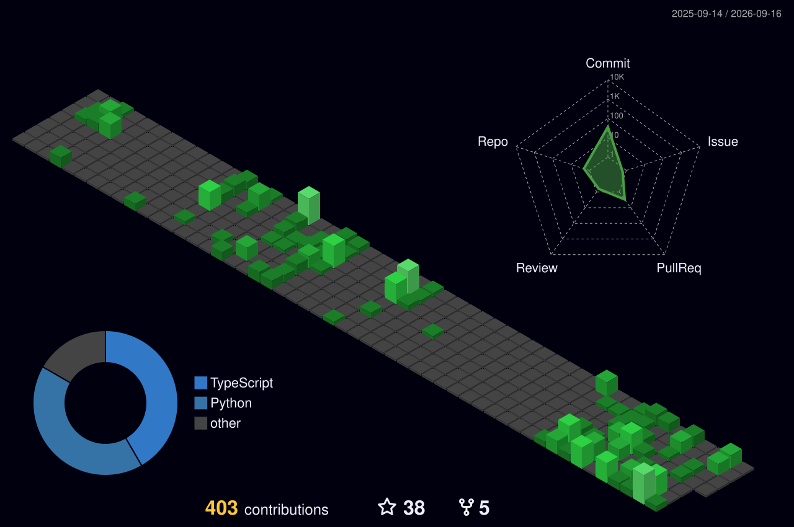

<!--
  ishworrsubedii / ishworrsubedii  —  profile README
  Palette : #050A07 void  ·  #0B3D2E moss  ·  #00FF9C signal  ·  #39FF14 neon  ·  #D1FAE5 text
  Rule    : one gradient hairline separates every section. Nothing else decorates.
-->

<div align="center">


<a href="https://ishwor-subedi.com.np/">
  
</a>

<br/>

<a href="https://ishwor-subedi.com.np/"></a>
<a href="https://www.linkedin.com/in/ishworrsubedii/"></a>
<a href="https://oxura.dev/"></a>
<a href="https://kaggle.com/ishworsubedii"></a>
<a href="https://www.leetcode.com/ishworrsubedii"></a>
<a href="mailto:ishworr.subedi@gmail.com"></a>


</div>

## `~/whoami`

```python
class IshworSubedi(MLEngineer):
    role      = "Machine Learning Engineer @oxura.dev"
    based_in  = "Kathmandu, Nepal (UTC+05:45)"
    builds    = ["computer vision pipelines", "LLM & agentic applications"]
    stack     = ["PyTorch", "OpenCV", "FastAPI", "Docker", "PostgreSQL"]
    exploring = ["agent orchestration", "retrieval quality", "on-device inference"]

    def working_on(self) -> str:
        return "taking research-grade models to production-grade reliability"

    def open_to(self) -> list[str]:
        return ["collaboration", "applied AI/ML roles", "a good technical argument"]
```

<div align="center"></div>

## What I build

<table>
<tr>
<td width="33%" valign="top">

### Computer Vision
Detection, tracking and counting on live video. YOLO-family models, custom training, OCR and ANPR, deployed against real camera feeds instead of curated datasets.

</td>
<td width="33%" valign="top">

### LLM & Agentic Systems
Retrieval pipelines, tool-using agents, and generative interfaces — built with prompt evaluation and failure handling as part of the design, not an afterthought.

</td>
<td width="33%" valign="top">

### Shipping the Model
The unglamorous half: FastAPI services, containerised inference, versioned artefacts, monitoring, and latency budgets that hold under load.

</td>
</tr>
</table>

<div align="center"></div>

## Selected work

<div align="center">

<a href="https://github.com/ishworrsubedii/person_tracker_and_counter">
  
</a>
<a href="https://github.com/ishworrsubedii/automatic_number_plate_detection_recognition-traffic_light_violation">
  
</a>
<a href="https://github.com/ishworrsubedii/ico-gen">
  
</a>
<a href="https://github.com/ishworrsubedii/machine_learning_algorithms">
  
</a>

</div>

| Project | What it does | Why it was hard |
| :--- | :--- | :--- |
| **[Person Tracker & Counter](https://github.com/ishworrsubedii/person_tracker_and_counter)** | Real-time detection, tracking and persistent counting from a video feed | Keeping identity stable across occlusion and re-entry without inflating the count |
| **[Trinetra — ANPR](https://github.com/ishworrsubedii/automatic_number_plate_detection_recognition-traffic_light_violation)** | Nepali number-plate recognition plus traffic-light violation detection | Devanagari plates, motion blur, and night footage break off-the-shelf OCR |
| **[ICO-Gen](https://github.com/ishworrsubedii/ico-gen)** | Text-prompt icon generation, end to end in TypeScript | Turning a generative model into a product with a usable interface |
| **[ML Algorithms](https://github.com/ishworrsubedii/machine_learning_algorithms)** | Notes, implementations and projects from the ground up | Written to be read — the reference I wish I'd had while learning |

<div align="center"></div>

## Toolchain

<table>
<tr><td><b>Languages</b></td><td>


</td></tr>
<tr><td><b>ML &amp; Vision</b></td><td>


</td></tr>
<tr><td><b>LLM &amp; Agents</b></td><td>


</td></tr>
<tr><td><b>Data</b></td><td>


</td></tr>
<tr><td><b>Serving &amp; Ops</b></td><td>


</td></tr>
</table>

<div align="center"></div>

## The commit city

<div align="center">

<!-- Generated daily by .github/workflows/profile-3d.yml — see setup notes at the bottom -->


</div>

<div align="center">


</div>

<div align="center"></div>

## Algorithms, daily

<div align="center">


</div>

<div align="center"></div>

## Something worth reading

<div align="center">


<br/><br/>

> **“The magic you are looking for is in the work you are doing.”**

</div>

<div align="center"></div>

<div align="center">

<!-- Generated by .github/workflows/snake.yml -->


### Working on something in vision or LLMs?

I'm open to collaborations, applied AI/ML roles, and interesting problems.

<a href="mailto:ishworr.subedi@gmail.com"></a>


<sub></sub>

</div>
